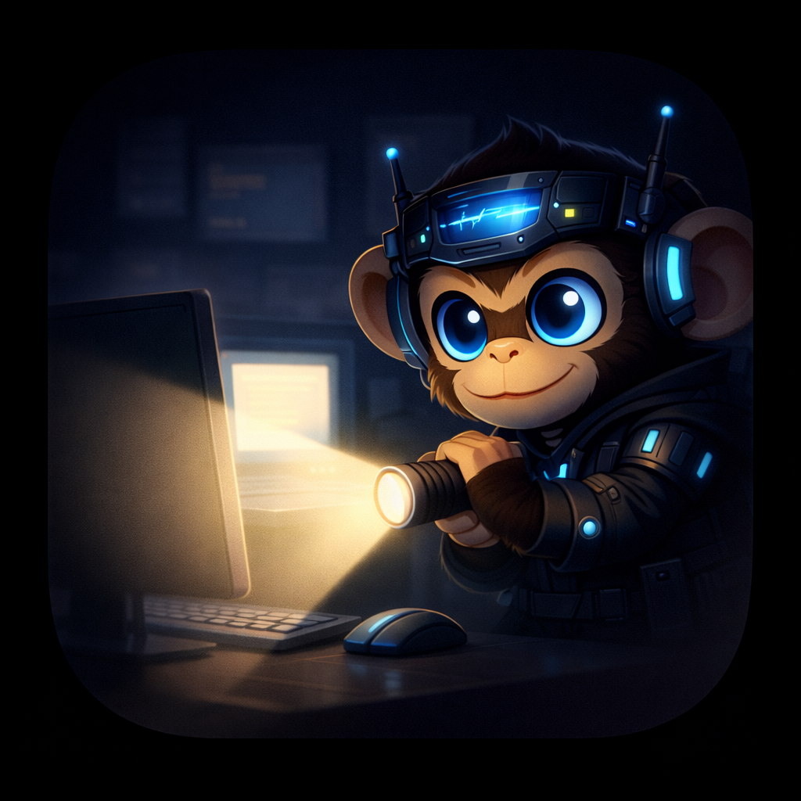

<p align="center">
  
  <h1 align="center">🐒⚡ Monkey Flash</h1>
  <p align="center">
    <strong>집중 모드를 위한 macOS 화면 하이라이터</strong>
  </p>
  <p align="center">
    현재 활성 창만 밝게, 나머지는 어둡게 — 집중력을 높여주는 심플한 유틸리티
  </p>
  <p align="center">
    
    
    
    
  </p>
</p>

---

## ✨ 주요 기능

- 🪟 **포커스 하이라이팅** — 현재 활성 창만 밝게, 나머지 화면은 디밍 처리
- ⚡ **120fps 트래킹** — 창 이동/리사이즈를 부드럽게 실시간 추적
- 🔲 **창 모서리 반지름 감지** — 실제 창 R값에 맞게 하이라이트 테두리를 둥글게 처리
- 🎚️ **디밍 강도 조절** — 설정 창에서 슬라이더로 세밀하게 조절
- 💨 **블러 모드** — 배경 흐림 효과 + 세기 조절
- ⌨️ **글로벌 단축키** — 원하는 키 조합을 직접 등록 (완전 커스텀)
- 🖥️ **멀티 모니터 지원** — 여러 디스플레이 환경에서도 동작
- 🪶 **초경량** — 외부 의존성 없음, AppKit + SwiftUI만 사용

## 📋 요구 사항

| 항목 | 조건 |
|-----|------|
| OS | macOS 13 Ventura 이상 (macOS Tahoe 호환) |
| Chip | Apple Silicon (M1/M2/M3/M4) |
| 빌드 도구 | Xcode Command Line Tools |
| 권한 | 손쉬운 사용 (Accessibility) |

## 🚀 빠른 시작

### 소스에서 빌드 & 실행

```bash
git clone https://github.com/Devguru-J/Monkey_Flash.git
cd Monkey_Flash

# 빌드
chmod +x build.sh run.sh package.sh
./build.sh

# 실행
./run.sh
```

### DMG 설치 파일 생성

다른 Mac으로 옮길 때 사용합니다:

```bash
./package.sh
# → build/MonkeyFlash.dmg 생성
```

> [!TIP]
> DMG 파일을 AirDrop이나 USB로 복사하면 빌드 환경 없이도 설치할 수 있습니다.

## 📦 설치 (DMG)

1. `MonkeyFlash.dmg`를 더블클릭
2. `MonkeyFlash.app`을 **Applications** 폴더로 드래그
3. 처음 실행 시 **우클릭 → 열기** (Gatekeeper 우회)

> [!IMPORTANT]
> **손쉬운 사용 권한**이 필수입니다.
> 시스템 설정 → 개인정보 보호 및 보안 → 손쉬운 사용 → Monkey Flash **ON**

자세한 설치 방법은 [INSTALL.md](./INSTALL.md)를 참고하세요.

## 🎮 사용법

앱 실행 후 메뉴바의 **"Focus"** 아이콘을 클릭하면 설정 창이 열립니다.

### 설정 창 탭 구성

| 탭 | 주요 설정 |
|----|---------|
| **General** | 하이라이트 켜기/끄기, 상태바 아이콘 표시, 접근성 권한 요청 |
| **Visual** | 디밍 투명도 (15%~90%), 블러 켜기/끄기, 블러 세기 (10%~100%) |
| **Shortcuts** | 각 동작에 글로벌 단축키 자유롭게 등록 |

### 단축키 등록 방법

1. **Shortcuts** 탭 열기
2. 원하는 동작 옆 입력 칸 클릭 → `Recording…` 상태 진입
3. 원하는 키 조합 누르기 (예: `⌘⌥H`)
4. `Esc` = 취소 / `Delete` = 해당 단축키 삭제

### 등록 가능한 동작

| 동작 | 설명 |
|-----|------|
| Enable / Disable | 하이라이트 전체 켜기/끄기 |
| Open Settings | 설정 창 열기 |
| Increase / Decrease Dim | 배경 어둡기 조절 |
| Toggle Blur | 블러 모드 켜기/끄기 |
| Increase / Decrease Blur | 블러 세기 조절 |

## 🏗️ 프로젝트 구조

```
Monkey_Flash/
├── main.swift              # 앱 진입점
├── AppState.swift          # 공유 설정 상태 (ObservableObject)
├── AppDelegate.swift       # 앱 생명주기 + 오버레이 관리
├── HotkeyManager.swift     # 글로벌 단축키 등록/관리
├── SettingsView.swift      # SwiftUI 설정 창
├── ScreenHighlighter.swift # 오버레이 뷰/윈도우 코어
├── AppIcon.icns            # 앱 아이콘
├── build.sh                # 빌드 스크립트
├── run.sh                  # 실행 스크립트
├── package.sh              # DMG 패키징 스크립트
└── build/                  # 빌드 결과물 (gitignore)
    ├── MonkeyFlash.app
    └── MonkeyFlash.dmg
```

## 🔧 동작 원리

1. **AX (Accessibility) API**로 현재 포커스된 창의 위치·크기·모서리 반지름 실시간 조회
2. **CGWindowList API**를 보조로 활용하여 정확도 향상
3. 모든 스크린에 **투명 오버레이 윈도우** 배치 (level: `.screenSaver`)
4. 오버레이에 디밍을 채우고, 포커스 창 영역만 **clear blend + rounded path**로 투명하게 제거
5. **Combine**으로 설정 변경을 실시간 구독하여 즉시 반영

## 🐛 문제 해결

| 증상 | 해결 방법 |
|-----|----------|
| "손상된 앱" 경고 | `xattr -cr /Applications/MonkeyFlash.app` |
| 하이라이트가 안 됨 | 시스템 설정 → 손쉬운 사용 권한 확인 |
| 앱이 안 보임 | 메뉴바 "Focus" 텍스트 확인 (설정에서 상태바 아이콘 숨기면 Dock에 표시) |
| 단축키가 작동 안 함 | Shortcuts 탭에서 키 조합이 등록되어 있는지 확인 |

## 📄 라이선스

[MIT License](./LICENSE) — 자유롭게 사용, 수정, 배포할 수 있습니다.
